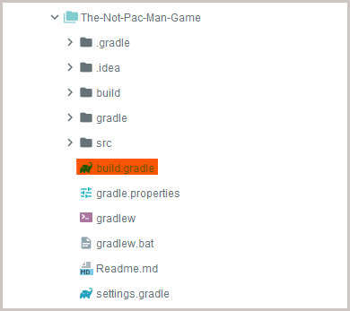

# The not pac-man game!
> Learn kotlin through this game, that is not pack man

### About the game

In this game you are 'I'. Your mission is to collect all the coins 'S'/'C', while going around walls '#'.
Enter "W,A,S,D" to move on the game board. 

You have a set number of moves and when your moves run out the game is over!

Silver coins 'S' give you points while Gold coins 'G' give you points and extra moves.

Once you have used up all your moves you get your score.

###### Sample board:
```
Starting - enter W/A/S/D to move
NUMBER OF MOVES LEFT : 10
# # # # # # # # # # # # # # # # #
# . . . . . . . . . . . G G . . #
# . . . . . . . . . . # . . . . #
# . . . . # . . . . . . . # C . #
# . . . . . . . . C . . . . . . #
# . . . . . . . . . . C . . . . #
# . . . . . . . . . . . . . C . #
# . . . . . . . . . I . . . . . #
# . . C . . . # . . . C . . . . #
# . . . . . . . . . # . . . . . #
# . . # . . . . . . . . . . . . #
# . . . G . . . . . . . # . . . #
# . . . . C . . . . . . . . . . #
# . . . . . . C C . . . . . . . #
# . . # . . . . . . . . . . . . #
# . # . . . . . . . . . # . . . #
# # # # # # # # # # # # # # # # #
```

**This is a gradle project that was coded in injellij, you can use any code editor you like, but for this tutorial we can only help you with IDE troubles if they are in intellij.** 

### Starting the project

* clone the project

* open intellij, select open or import


* in The-Not-Pac-Man-Game project there is a build.gradle file, select that file



* Select open as project


* wait for intellij to load up the project

* Once complected you should see the following files


